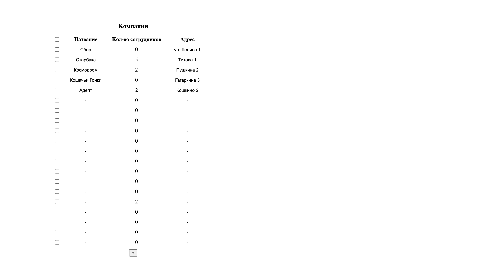
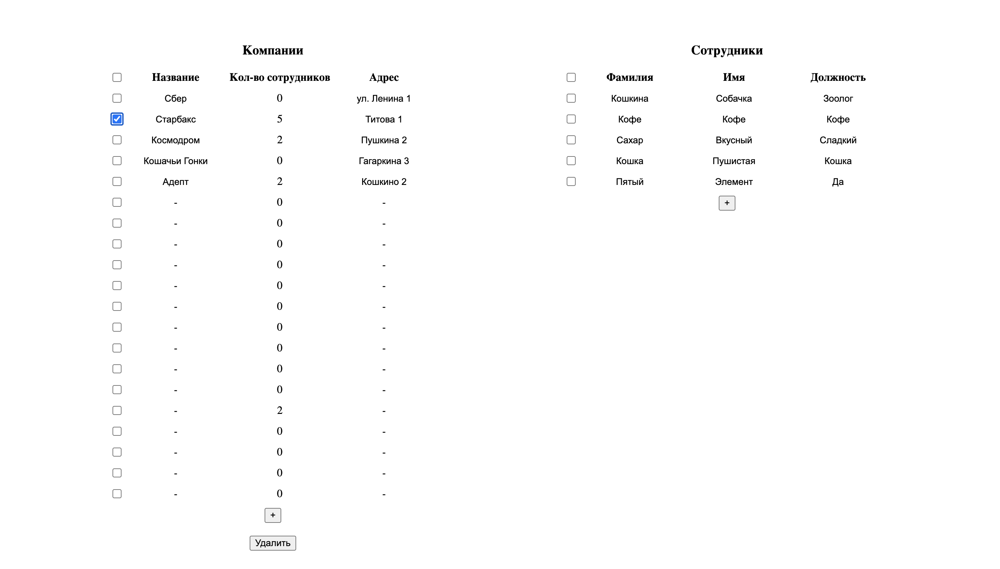
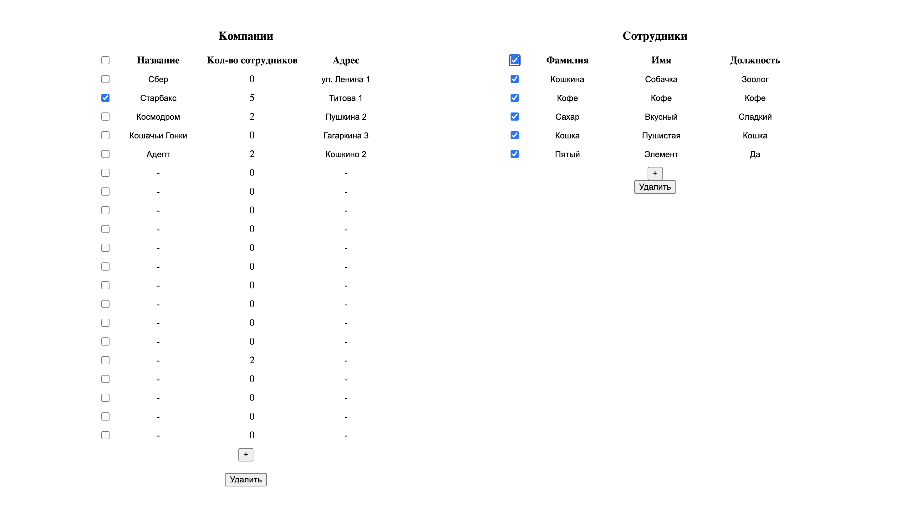

# Тестовое задание на вакансию Front-end Developer

### Версия node: v16.13.1
## Чтобы запустить проект нужно:
1) `git clone` репозитория
2) `npm install` для установки всех пакетов
3) `npm run startAll` для запуска сервера и приложения
4) Подождать компиляции и можно пользоваться!
## Cтек:
1) React: 18.2.0
2) Redux: 4.2.0
3) Json-server: 0.17.0
4) Axios: 1.1.2

#### Проект представляет собой одностраничное приложение с имитацией запросов с сервера
### Все редактируемые данные сохраняются в файл и потом берутся от туда же!
#### На экране таблица компаний

#### При выборе одной из них появится список сотрудников этой компании
#### Поле количества сотрудников редактируется автоматически
#### Сверху есть кнопка "Выделить все"

#### Каждый из списков полностью редактируется, есть возможность поменять каждую ячейку (кроме ячейки с количеством сотрудников) и добавить/удалить элемент по одному или пачками

#### Проект рассчитан на большие объемы данных, поэтому по мере скроллинга данные будут постепенно прогружаться

